# FortiGate Security Architecture

## Overview

This section documents the security architecture of the SOC Homelab Enterprise environment built around a FortiGate 60F firewall and FortiSwitch infrastructure.

The FortiGate firewall serves as the central security enforcement point for all VLANs, inter-VLAN communication, DMZ access control, SOC monitoring systems, AWS connectivity, and network segmentation policies.

The environment follows a defense-in-depth architecture by separating users, servers, management systems, security monitoring platforms, guest devices, attack simulation targets, and red team infrastructure into dedicated security zones.

---

## Security Objectives

* Implement enterprise-style network segmentation
* Restrict east-west traffic between security zones
* Protect server infrastructure from unauthorized access
* Isolate vulnerable applications inside a DMZ
* Separate security monitoring systems from user networks
* Centralize security visibility through Wazuh and Splunk
* Provide secure connectivity to AWS resources through IPsec VPN
* Enable full packet visibility using SPAN port monitoring
* Isolate guest wireless devices from internal infrastructure

---

## Network Segmentation

The environment is segmented into dedicated VLANs:

| VLAN        | Network         | Purpose                                          |
| ----------- | --------------- | ------------------------------------------------ |
| SOC_NET     | 192.168.10.0/24 | Splunk, Wazuh, Security Monitoring               |
| USER_NET    | 192.168.20.0/24 | Corporate Endpoints                              |
| SERVER_NET  | 192.168.30.0/24 | Active Directory and Infrastructure Services     |
| MGMT_NET    | 192.168.40.0/24 | Administrative Management Network                |
| DMZ_NET     | 192.168.50.0/24 | Vulnerable Web Applications                      |
| HOME_NET    | 192.168.60.0/24 | Trusted Personal Devices                         |
| GUEST_WIFI  | 192.168.70.0/24 | Internet-Only Guest Wireless Network             |
| REDTEAM_NET | 192.168.80.0/24 | Offensive Security and Attack Simulation Systems |

### VLAN Segmentation

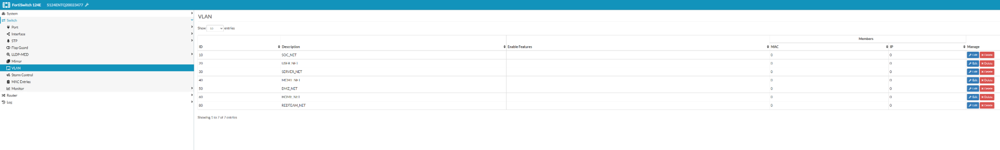

### FortiGate Network Interfaces

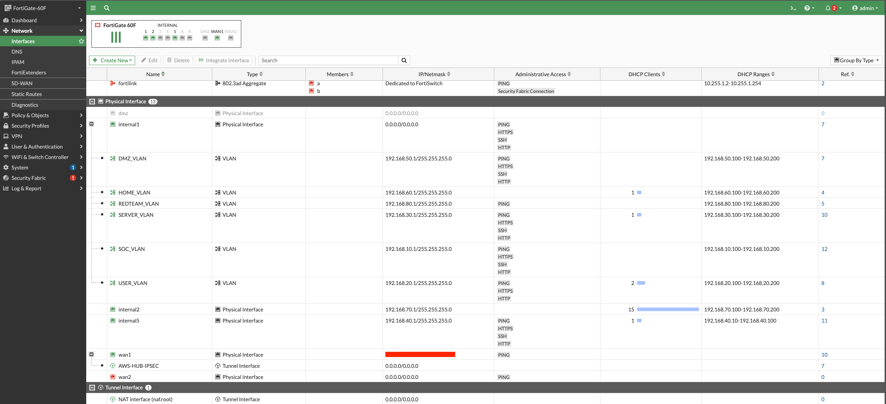

---

## Security Monitoring Architecture

Dedicated SOC infrastructure is isolated from user, server, guest, and management networks.

### Security Platforms

| System          | IP Address    | Function                    |
| --------------- | ------------- | --------------------------- |
| WAZUH01         | 192.168.10.10 | SIEM / XDR Platform         |
| SPLUNK01        | 192.168.10.20 | Security Analytics Platform |
| SURICATA Sensor | SPAN Port     | Network IDS                 |

### Log Sources

The SOC monitoring environment currently collects telemetry from:

* Windows Server 2022 Domain Controller (DC01)
* Windows 11 Enterprise Workstation
* Kali Linux Attack Platform
* Suricata IDS Sensor
* FortiGate Firewall
* AWS Infrastructure
* OWASP Juice Shop
* DVWA

Security telemetry is collected from:

* Windows endpoints
* Active Directory
* Network traffic
* AWS infrastructure
* Suricata IDS
* Application attack simulations
* FortiGate firewall logs
* IPsec VPN tunnel activity

---

## Controlled Access to SOC Infrastructure

Access to SIEM platforms is explicitly controlled through dedicated firewall policies.

### User Access to Wazuh

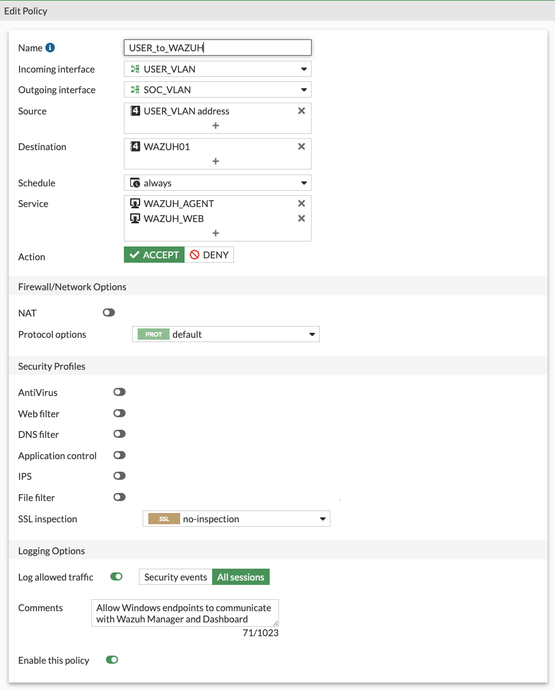

### Server Access to Wazuh

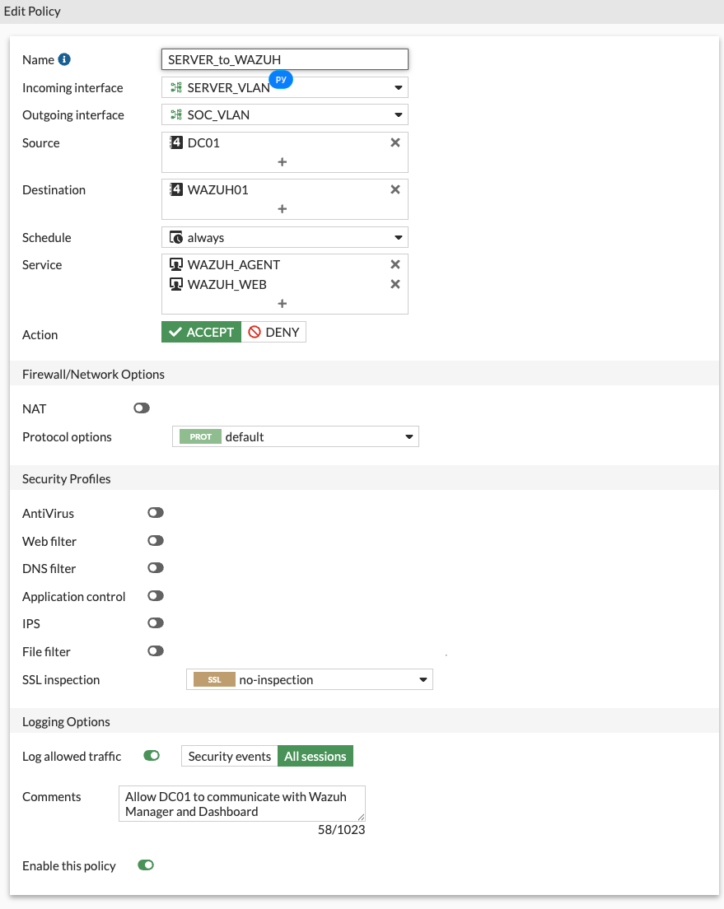

### Custom Wazuh and Splunk Services

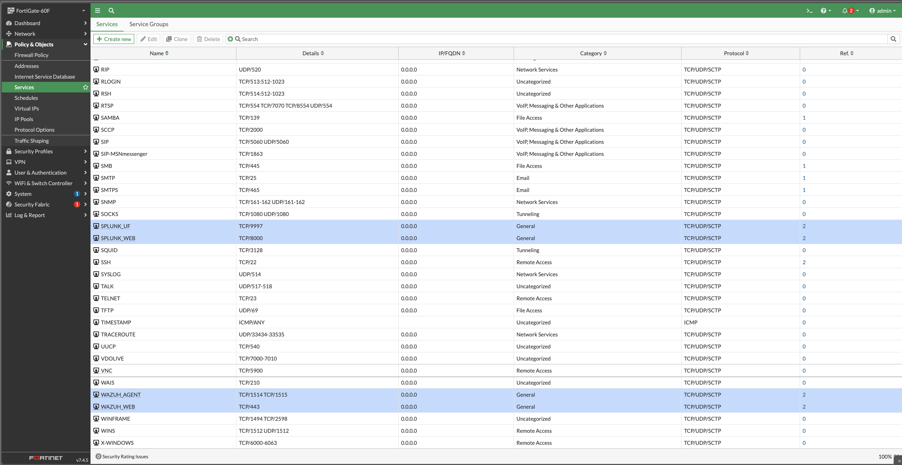

### Additional Custom Services

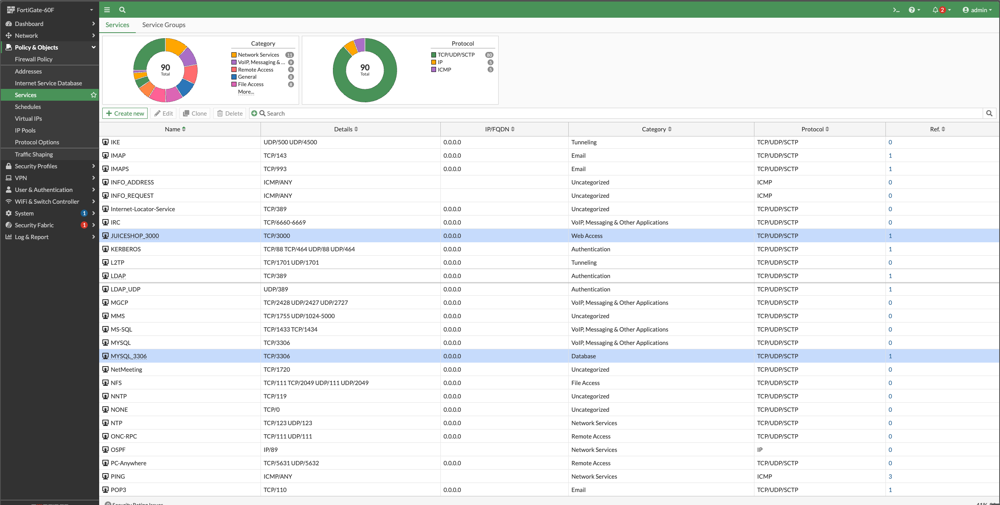

Dedicated firewall service objects were created for Splunk and Wazuh communications, allowing granular policy enforcement instead of broad inter-VLAN access rules.

---

## DMZ Security Controls

Vulnerable applications used for attack simulations are isolated inside a dedicated DMZ network.

### Hosted Applications

* OWASP Juice Shop
* DVWA (Damn Vulnerable Web Application)

Access to backend resources is restricted through explicit firewall rules.

### DMZ to Database Access

Only MySQL traffic (TCP/3306) is permitted from the DMZ to the backend database server.

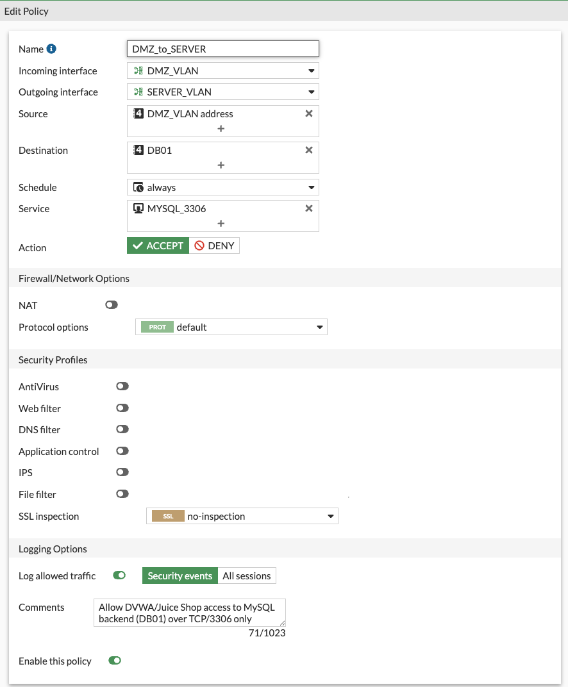

---

## Firewall Policy Enforcement

The FortiGate firewall enforces segmentation and communication paths between all security zones.

Examples include:

* USER → WAZUH
* USER → SPLUNK
* SERVER → WAZUH
* SERVER → SPLUNK
* USER → DMZ
* DMZ → Database
* AWS VPN Connectivity
* Management Network Access

### Firewall Policy Matrix

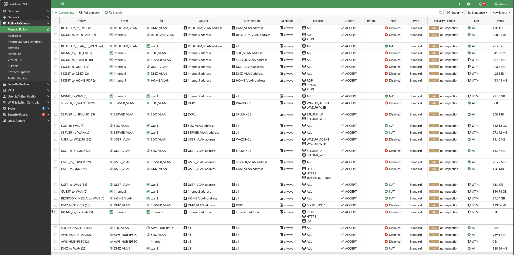

---

## Least Privilege Network Design

The firewall policy architecture follows the principle of least privilege.

Examples include:

* USER_NET access to Wazuh is restricted to required management ports only.
* USER_NET access to Splunk is restricted to required services only.
* SERVER_NET communicates with SOC infrastructure through dedicated policies.
* DMZ systems are restricted to MySQL connectivity only.
* Guest Wi-Fi devices are isolated from internal resources.
* Inter-VLAN communication is explicitly controlled through firewall policies.

This approach minimizes attack surface and limits opportunities for unauthorized lateral movement.

The final architecture eliminates unnecessary broad access rules and replaces them with dedicated security policies for monitoring, administration, application access, and cloud connectivity.

---

## Address Objects

Network and host objects are defined to simplify policy management and improve rule readability.

Examples include:

* DC01
* WAZUH01
* SPLUNK01
* DB01
* VLAN Network Objects

### Address Object Inventory

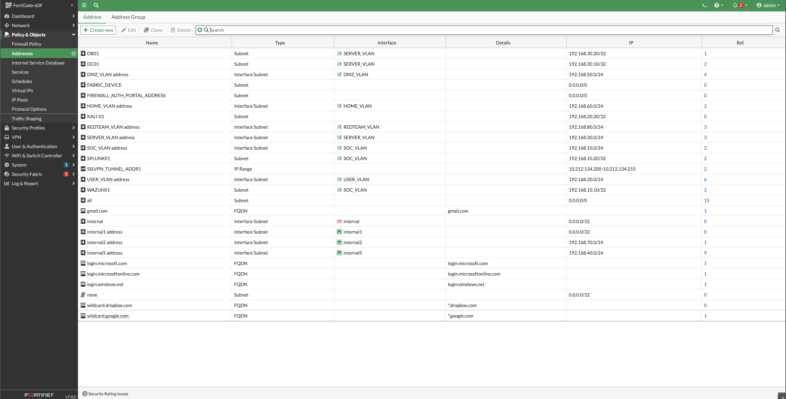

---

## AWS Integration

The SOC environment maintains secure connectivity with AWS resources through a site-to-site IPsec tunnel.

Capabilities include:

* Secure cloud connectivity
* Remote log collection
* Hybrid SOC architecture
* Cross-network visibility

### AWS IPsec Tunnel

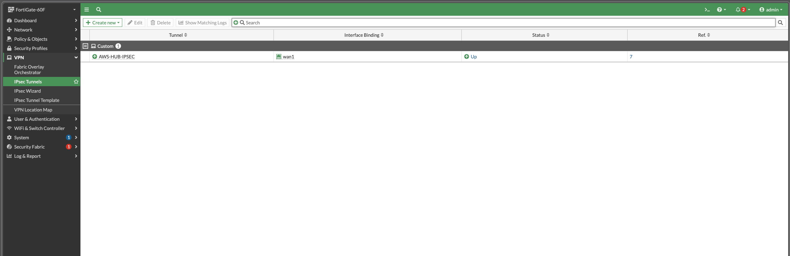

---

## Network Detection and Monitoring

A dedicated Suricata sensor receives mirrored traffic from the FortiSwitch SPAN port.

This architecture provides:

* Full packet visibility
* IDS monitoring
* Detection engineering validation
* Attack simulation monitoring
* Network forensic analysis

### SPAN Port Configuration

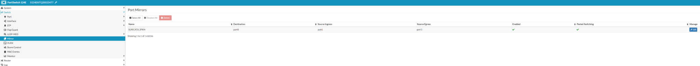

---

## Guest Wireless Isolation

A dedicated Guest Wi-Fi network is separated from all production, server, management, and SOC infrastructure.

Guest devices are permitted Internet access only and have no direct access to:

* Active Directory
* Servers
* SOC Monitoring Systems
* Management Network
* Red Team Infrastructure

This segmentation reduces the risk of unauthorized lateral movement from unmanaged or untrusted devices.

---

## Security Outcomes

This implementation demonstrates practical experience with:

* FortiGate Firewall Administration
* FortiSwitch Administration
* Enterprise Firewall Administration
* Network Segmentation
* VLAN Design
* Security Zone Design
* Least Privilege Network Design
* Access Control Policies
* Security Monitoring Architecture
* Wazuh Deployment
* Splunk Integration
* IDS Visibility Engineering
* SPAN Port Configuration
* Network Traffic Visibility
* AWS Hybrid Networking
* Hybrid Cloud Connectivity
* IPsec VPN Configuration
* Detection Engineering Support
* Defense-in-Depth Architecture
* Security Operations Infrastructure
* Enterprise Network Security Architecture
* SOC Infrastructure Design

---

## Lessons Learned

During the implementation of this security architecture, several important operational and security considerations were identified:

* Effective network segmentation significantly reduces the potential impact of lateral movement during a security incident.
* Dedicated SOC infrastructure should be isolated from user, server, guest, and management networks whenever possible.
* Custom firewall service objects improve policy readability and simplify long-term administration.
* SPAN port monitoring provides valuable network visibility without introducing additional traffic into production segments.
* Vulnerable applications such as DVWA and OWASP Juice Shop should always be isolated within a dedicated DMZ.
* Security monitoring platforms require carefully controlled access paths to balance visibility and security.
* Site-to-site VPN connectivity introduces additional routing and security considerations that must be validated through firewall policies and monitoring.
* Comprehensive logging across firewall policies, IDS sensors, endpoints, servers, and VPN infrastructure greatly improves investigation capabilities during incident response.
* Building and maintaining a segmented environment provides practical experience that closely aligns with enterprise SOC operations and detection engineering workflows.

### Future Improvements

Planned enhancements include:

* Integration of FortiGate IPS profiles for additional threat prevention
* SSL inspection testing within isolated lab environments
* Additional detection engineering use cases
* Expanded attack simulation scenarios
* Automated security reporting and dashboard development
* Additional cloud-connected monitoring resources
* Expanded cloud monitoring and log ingestion capabilities
* Additional network detection and response validation exercises

---

## Technologies Used

* FortiGate 60F
* FortiSwitch 124E
* Wazuh
* Splunk Enterprise
* Suricata IDS
* Windows Server 2022
* Active Directory
* Sysmon
* AWS EC2
* Site-to-Site IPsec VPN
* VLAN Segmentation
* SPAN Port Monitoring
* Security Event Monitoring
* Firewall Policy Engineering
* Network Traffic Analysis
