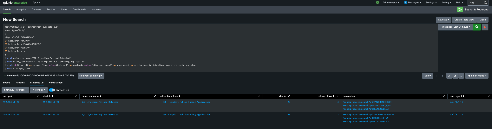
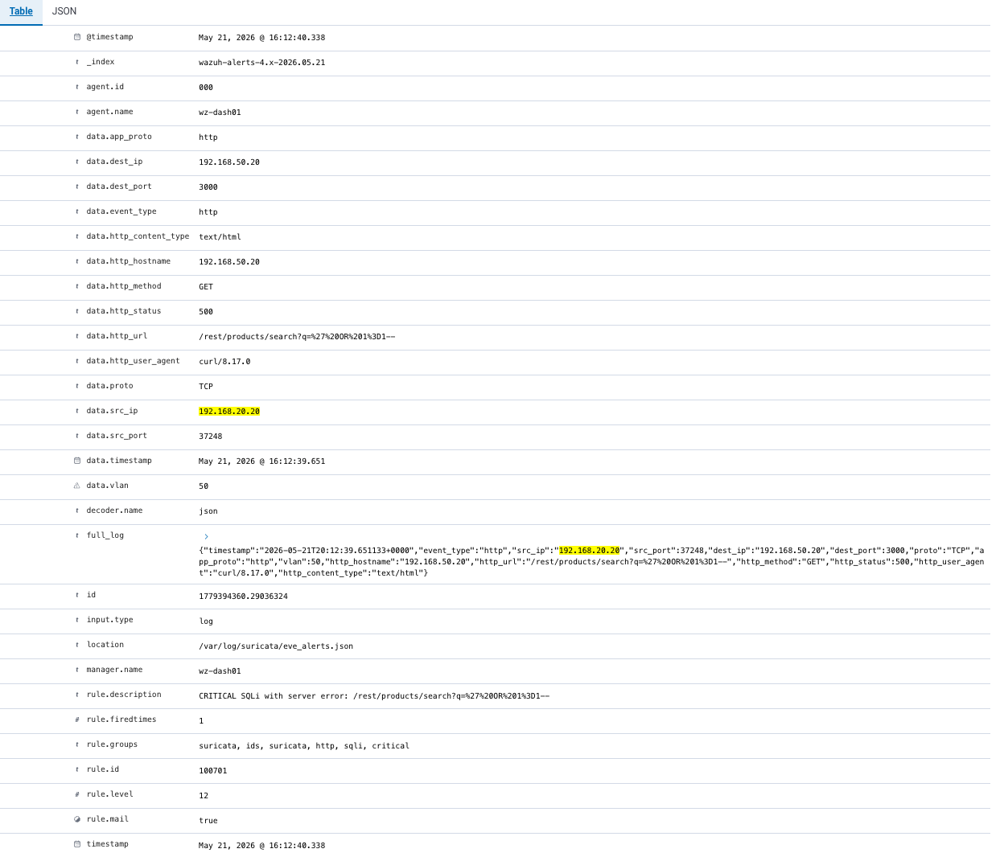

# SQL Injection Attack Simulation

## Objective

The objective of this simulation was to emulate a real-world SQL Injection attack against intentionally vulnerable web applications hosted in the SOC Homelab Enterprise environment.

The goal was to validate:

- Attack telemetry visibility
- IDS monitoring
- EVE JSON telemetry generation
- SIEM log ingestion
- Detection engineering workflows
- Dashboard visibility across the SOC stack

---

## Lab Environment

| Component | Value |
|------------|--------|
| Attacker | KALI-01 (192.168.20.20) |
| Targets | DVWA (192.168.50.10), Juice Shop (192.168.50.20) |
| IDS | Physical Suricata Sensor |
| SIEM | Splunk Enterprise + Wazuh |
| Network Visibility | FortiSwitch SPAN / Mirror Port |

---

## Attack Scenario

SQL Injection attacks were executed from the Kali Linux attack workstation against intentionally vulnerable web applications deployed inside the DMZ network.

The objective of the simulation was to validate:

- Web application attack visibility
- Suricata network telemetry
- EVE JSON log generation
- Splunk searchable events
- Wazuh alert visibility
- Detection engineering opportunities

Traffic traversed segmented VLANs and was observed through the FortiSwitch SPAN configuration feeding the physical Suricata sensor.

---

## Attack Flow

```text
KALI-01 (192.168.20.20)
        ↓
Juice Shop / DVWA
        ↓
FortiSwitch SPAN
        ↓
Physical Suricata Sensor
        ↓
EVE JSON
        ↓
Splunk + Wazuh
        ↓
Detection & Dashboard Visibility
```

---

## Payloads Used

The following SQL Injection payloads were successfully tested during the simulation:

```sql
' OR 1=1--
OR SLEEP(5)--
UNION SELECT
```

All payloads successfully generated telemetry and triggered custom detections.

A benign search request was also tested:

```text
apple
```

The benign request did **not** trigger the detection logic, validating false-positive reduction.

---

## Telemetry Observed

The attack generated real telemetry across the SOC monitoring stack.

Observed artifacts included:

- URL-encoded SQL Injection payloads
- Source and destination IP visibility
- HTTP URL logging
- User-Agent visibility
- VLAN-tagged traffic visibility
- EVE JSON telemetry from Suricata
- Splunk searchable events
- Wazuh alert generation

### Example Observed Traffic

```text
Source IP:      192.168.20.20 (KALI-01)
Destination:    192.168.50.20 (Juice Shop)
Protocol:       HTTP
Attack Type:    SQL Injection

Example Payload:
/rest/products/search?q=%27%20OR%201%3D1--
```

---

## Splunk Detection Engineering

Default Emerging Threats (ET) SQL Injection signatures did not consistently trigger for all attack variations.

### Detection Challenges

Key findings included:

- Some SQL Injection response rules were disabled or commented
- URL-encoded payloads reduced signature reliability
- Generic SQL Injection signatures did not consistently detect all requests
- Time-based payloads generated telemetry without reliable alerting

This created an opportunity to develop custom SQL Injection detection logic.

### Detection Improvements

Custom Splunk detection logic was developed using:

- URL-encoded payload inspection
- HTTP request visibility
- Source and destination correlation
- Payload analysis
- Flow normalization using `dc(flow_id)`
- MITRE ATT&CK mapping

Due to SPAN visibility across trunked VLAN traffic, duplicate events were observed. Attack counting was normalized using distinct flow IDs (`dc(flow_id)`) to avoid overcounting.

### Custom SQL Injection Detection — Splunk



---

## Wazuh Alert Correlation

Custom Wazuh rules successfully detected SQL Injection activity and escalated severity when server-side application errors occurred.

### Wazuh Detection Highlights

- Rule ID `100700` — SQL Injection pattern detection
- Rule ID `100701` — Critical SQL Injection with server error
- Severity escalation based on HTTP response behavior
- Payload visibility
- Source and destination attribution
- Real-time alert generation

Critical alerts were generated when SQL Injection attempts produced server-side HTTP `500` errors.

### Critical SQL Injection Alert — Wazuh



---

## MITRE ATT&CK Mapping

| Technique | Description |
|------------|-------------|
| T1190 | Exploit Public-Facing Application |

The attack simulation aligns with **MITRE ATT&CK T1190 — Exploit Public-Facing Application**, commonly associated with web application exploitation and initial access attempts.

---

## Lessons Learned

Key lessons from this simulation included:

- Signature-based detection alone is insufficient
- Detection engineering improves visibility
- URL encoding reduces signature reliability
- SPAN visibility creates duplicate telemetry
- `dc(flow_id)` improves event normalization
- Splunk and Wazuh correlation strengthens investigations
- Real attack simulations improve SOC analyst readiness

---

## Detection Outcome

The SQL Injection simulation successfully demonstrated:

- End-to-end attack visibility
- Network telemetry collection
- Custom detection engineering
- False-positive reduction
- Wazuh severity escalation
- SIEM correlation across platforms
- Real-world SOC analyst workflow validation
