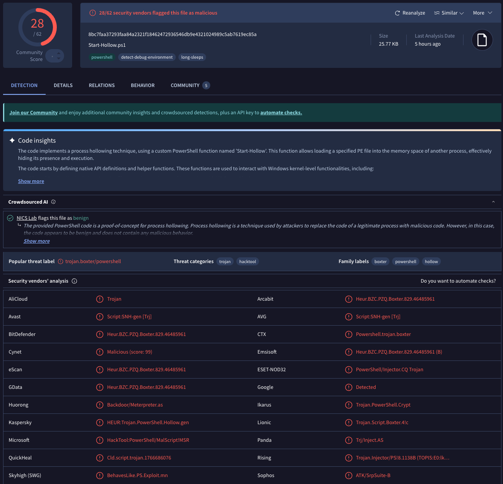
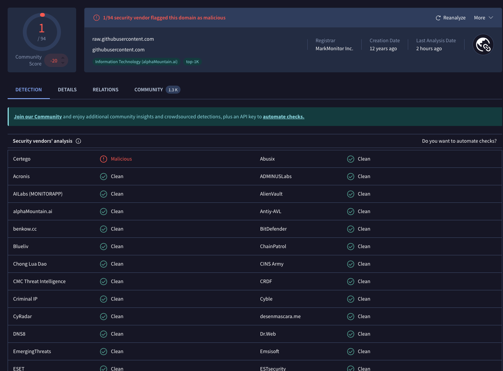
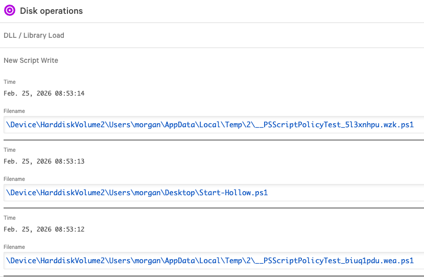
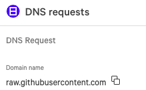

# PowerShell Process Injection Investigation (MITRE T1055)

## Incident Summary

A CrowdStrike Falcon detection identified suspicious PowerShell activity associated with a potential Process Injection attack on a Windows Server 2022 endpoint.

The investigation revealed execution of a PowerShell script named `Start-Hollow.ps1`, a script commonly associated with Process Hollowing techniques used by adversaries to inject malicious code into legitimate processes.

CrowdStrike successfully detected and prevented execution before compromise could be confirmed.

---

## Environment

| Field | Value |
|---------|---------|
| Host | VMI1146645 |
| Operating System | Windows Server 2022 |
| User | morgan |
| Login Type | Remote Interactive (RDP) |
| Detection | PShellInjectSysProc |
| Severity | High |
| MITRE ATT&CK | T1055 Process Injection |

---

## Investigation Objectives

- Determine whether malicious code execution occurred.
- Identify the source of the PowerShell script.
- Validate network communications associated with the activity.
- Assess impact to the endpoint.
- Collect evidence for containment and remediation.

---

## Investigation Process

### Step 1 – Initial Alert Review

CrowdStrike Falcon generated a High Severity detection indicating PowerShell-based process injection activity.

The alert identified execution of a PowerShell script named:

```powershell
Start-Hollow.ps1
```

The script name strongly suggested Process Hollowing behavior associated with MITRE ATT&CK T1055.

---

### Step 2 – Threat Intelligence Validation

The script was analyzed using VirusTotal.

Results showed:

- 28 security vendors detected the file as malicious.
- Multiple vendors classified the file as Trojan or PowerShell malware.
- Detection names referenced Process Hollowing and PowerShell-based code injection.

Assessment:

The file presents a high-confidence malicious classification and should be considered hostile.

---

### Step 3 – Domain Reputation Analysis

Investigation identified DNS activity involving:

```text
raw.githubusercontent.com
```

VirusTotal reputation analysis indicated that the domain itself is generally trusted infrastructure.

Assessment:

GitHub infrastructure was likely used as a payload staging location rather than being malicious itself.

---

### Step 4 – Endpoint Activity Review

CrowdStrike telemetry identified PowerShell script execution activity.

Observed actions included:

- Script execution from user context.
- Temporary PowerShell policy test files created.
- Execution of Start-Hollow.ps1.
- PowerShell execution policy bypass behavior.

Assessment:

Activity is consistent with PowerShell-based malware staging and execution attempts.

---

### Step 5 – Network Activity Review

CrowdStrike DNS telemetry recorded outbound requests to:

```text
raw.githubusercontent.com
```

Assessment:

The endpoint attempted to retrieve content from GitHub-hosted infrastructure.

This behavior is commonly observed in malware delivery chains where payloads are hosted on trusted cloud platforms.

---

## Findings

| Finding | Status |
|----------|----------|
| Malicious PowerShell script identified | Confirmed |
| VirusTotal malicious detections | Confirmed |
| Process Hollowing behavior observed | Suspected |
| GitHub staging infrastructure used | Confirmed |
| PowerShell execution activity | Confirmed |
| Successful compromise | Not Confirmed |

---

## MITRE ATT&CK Mapping

| Technique ID | Technique |
|-------------|-----------|
| T1055 | Process Injection |
| T1059.001 | PowerShell |
| T1105 | Ingress Tool Transfer |
| T1071.001 | Web Protocols |

---

## Analyst Assessment

Based on available evidence, the activity represents a high-confidence malicious PowerShell execution attempt associated with Process Injection techniques.

The malicious script was successfully detected by CrowdStrike Falcon, and no evidence was identified confirming successful payload execution beyond the initial staging activity.

The incident demonstrates the importance of behavioral detection capabilities for PowerShell abuse and process injection techniques.

---

## Evidence

### VirusTotal File Analysis



### VirusTotal Domain Reputation



### CrowdStrike Script Execution Evidence



### CrowdStrike DNS Request Evidence



---

## Lessons Learned

- Trusted cloud services can be abused for malware delivery.
- PowerShell remains a common attack vector for initial execution and defense evasion.
- Threat intelligence validation significantly improves investigation confidence.
- Behavioral detections are effective against Process Injection techniques.
