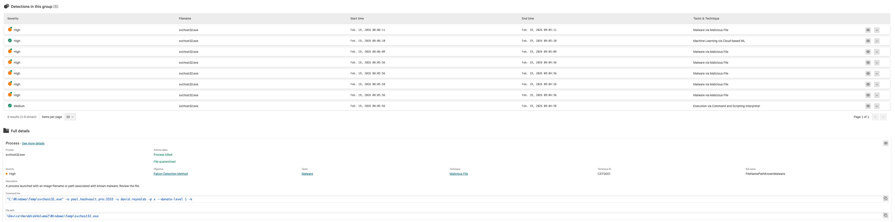
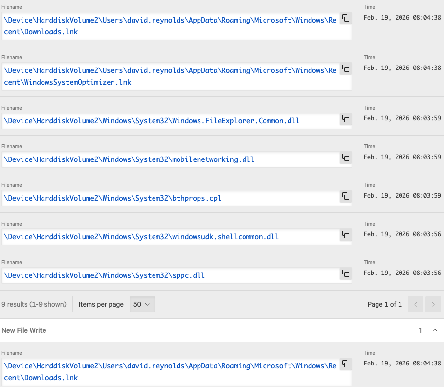
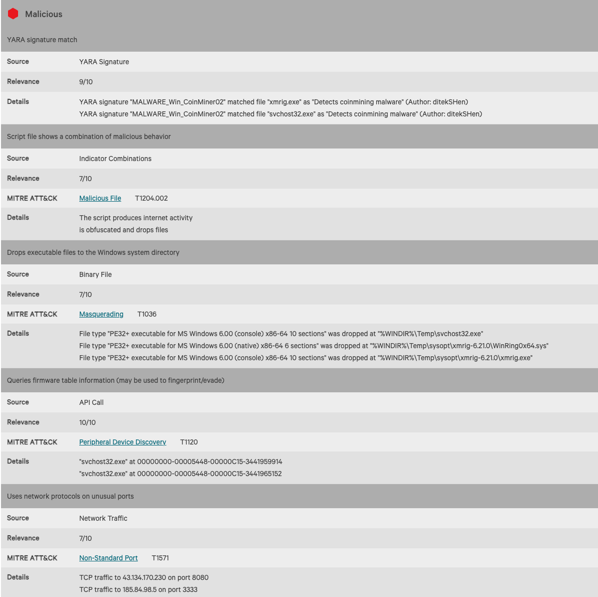
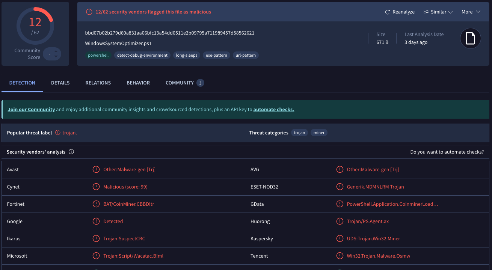
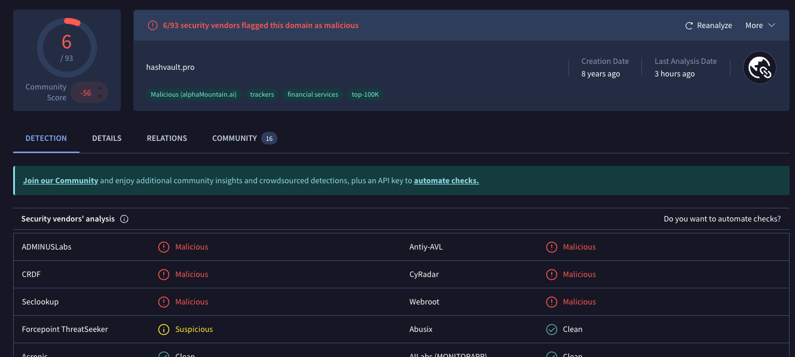

# XMRig Cryptomining Malware Investigation

## Executive Summary

A malware alert was generated after CrowdStrike Falcon detected suspicious execution of a cryptomining payload masquerading as a legitimate Windows process. The investigation identified XMRig cryptocurrency mining malware operating under the filename `svchost32.exe`.

The malware established outbound network communications to known mining infrastructure, created multiple artifacts on the host, and attempted to evade detection by using filenames similar to legitimate Windows system processes.

The malicious process was successfully detected, quarantined, and terminated by CrowdStrike Falcon.

---

## Incident Overview

| Field | Value |
|---------|---------|
| Investigation Type | Malware Analysis |
| Severity | High |
| Malware Family | XMRig Cryptominer |
| Detection Source | CrowdStrike Falcon |
| Status | Contained |
| MITRE ATT&CK | T1204.002, T1036, T1120, T1571 |

---

## Detection Summary

CrowdStrike Falcon generated multiple high-severity detections indicating execution of a known cryptomining malware payload.

The process:

```text
svchost32.exe
```

was identified as malicious and associated with cryptocurrency mining activity.

Detected behavior included:

- Execution of known cryptomining malware
- File drops within Windows directories
- Obfuscated PowerShell activity
- Network communication with mining infrastructure
- Masquerading as legitimate Windows processes

---

## Evidence Collected

### CrowdStrike Detection Overview



---

### File Write Artifacts



Observed file creation activity associated with malware execution.

---

### Sandbox Behavioral Analysis



Behavioral analysis identified:

- Coin mining activity
- File drops
- Obfuscation techniques
- Network communications
- Persistence-related artifacts

---

### VirusTotal Malware Analysis



Multiple security vendors classified the file as malicious.

---

### Domain Reputation Verification



Associated mining infrastructure domains were verified against VirusTotal reputation data.

---

## MITRE ATT&CK Mapping

| Technique | Description |
|------------|------------|
| T1204.002 | Malicious File Execution |
| T1036 | Masquerading |
| T1120 | Peripheral Device Discovery |
| T1571 | Non-Standard Port Communication |

---

## Timeline

| Time | Event |
|--------|--------|
| 08:03 | Malware execution initiated |
| 08:04 | Malicious files written to disk |
| 08:05 | Mining process launched |
| 08:06 | CrowdStrike generated detection |
| 08:06 | Process quarantined |
| 08:06 | Process terminated |

---

## Findings

The investigation confirmed successful execution of XMRig cryptomining malware.

Key findings:

- Malware executed under a disguised filename.
- Mining-related domains were contacted.
- Multiple malicious artifacts were written to disk.
- VirusTotal confirmed malicious reputation.
- CrowdStrike successfully contained the threat.

---

## Conclusion

The alert was determined to be a true positive malware detection involving XMRig cryptocurrency mining malware.

CrowdStrike Falcon successfully detected, quarantined, and terminated the malicious process before further impact to the endpoint.

No additional malicious activity was observed after containment actions were completed.
