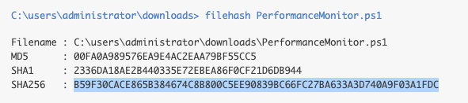
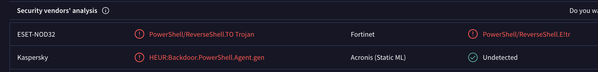

# Cobalt Strike Command and Control Communication Investigation

## Executive Summary

A CrowdStrike Falcon detection identified suspicious PowerShell activity associated with malicious Command and Control (C2) communications on a Windows Server endpoint.

The investigation revealed execution of a PowerShell script named `PerformanceMonitor.ps1`, which bypassed PowerShell execution restrictions and initiated communication with infrastructure associated with known Cobalt Strike activity.

Threat intelligence analysis confirmed connections to a malicious domain linked to Cobalt Strike Beacon operations.

CrowdStrike successfully detected the activity and generated multiple detections for further investigation.

---

## Incident Overview

| Field | Value |
|---------|---------|
| Investigation Type | Command and Control Investigation |
| Severity | High |
| Detection Source | CrowdStrike Falcon Intelligence |
| Host | VMI1146645 |
| User | Administrator |
| Status | Contained |
| MITRE ATT&CK | T1059.001, T1071.004, T1105, T1036, T1204.002 |

---

## Detection Summary

CrowdStrike Falcon generated multiple detections related to suspicious PowerShell execution and outbound communication with known malicious infrastructure.

The investigation identified execution of:

```powershell
PerformanceMonitor.ps1
```

Observed behavior included:

- PowerShell Execution Policy bypass
- Reverse shell functionality
- DNS beaconing activity
- Communication with malicious infrastructure
- PowerShell malware execution
- Potential Cobalt Strike Beacon activity

---

## Evidence Collected

### File Hash Verification



The suspicious PowerShell script was manually verified using CrowdStrike Real Time Response (RTR).

Collected indicators:

- File: `PerformanceMonitor.ps1`
- SHA256:
`B59F30CACE865B384674C8B800C5EE90839BC66FC27BA633A3D740A9F03A1FDC`

Assessment:

Hash validation confirmed the exact file executed on the endpoint and provided a reliable indicator for threat intelligence enrichment and reputation analysis.

---

### VirusTotal Malware Analysis



The PowerShell script was analyzed using VirusTotal.

Security vendor detections included:

- PowerShell/ReverseShell.TO Trojan
- PowerShell/ReverseShell.E!tr
- HEUR:Backdoor.PowerShell.Agent.gen

Analysis indicated the script functions as a reverse shell capable of establishing remote access to an infected system.

Assessment:

The file is classified as malicious and demonstrates behavior consistent with remote access malware and Cobalt Strike-style post-exploitation activity.

---

## Investigation Findings

### PowerShell Execution Policy Bypass

Observed command:

```powershell
powershell.exe -Command "if((Get-ExecutionPolicy) -ne 'AllSigned') { Set-ExecutionPolicy -Scope Process Bypass }"
```

Assessment:

The command temporarily bypassed PowerShell execution restrictions, allowing unsigned scripts to execute without administrative policy modifications.

This technique is commonly used by attackers to evade security controls.

---

### Process Tree Analysis

Observed process chain:

```text
explorer.exe
└── powershell.exe (PerformanceMonitor.ps1)
    └── conhost.exe
```

Assessment:

The PowerShell process originated from `explorer.exe`, indicating direct user execution rather than an automated system task.

---

### DNS Beaconing Activity

Observed domain:

```text
shichizaoa.top
```

Observed activity:

- 9 DNS requests
- Approximately 1 minute duration
- Repeated outbound communications

Assessment:

The communication pattern is consistent with beaconing behavior commonly observed in Command and Control frameworks such as Cobalt Strike.

---

### Threat Intelligence Correlation

Threat intelligence analysis identified:

- Recently registered domain
- Malicious reputation across multiple vendors
- CrowdStrike Falcon Intelligence correlation
- High-confidence Cobalt Strike indicator

Assessment:

The domain exhibited characteristics commonly associated with disposable attacker-controlled infrastructure used for post-exploitation operations.

---

## MITRE ATT&CK Mapping

| Technique ID | Technique |
|-------------|-----------|
| T1059.001 | PowerShell |
| T1071.004 | DNS |
| T1105 | Ingress Tool Transfer |
| T1036 | Masquerading |
| T1204.002 | User Execution: Malicious File |
| T1562.001 | Impair Defenses |

---

## Timeline

| Time | Event |
|--------|--------|
| 09:41:08 | Initial DNS beaconing observed |
| 09:42:21 | PowerShell process launched |
| 09:42:22 | Execution policy test file created |
| 09:42:24 | DNS communication initiated |
| 09:42:26 | Additional DNS beaconing observed |
| 09:42:34 | PowerShell execution activity continued |
| 09:42:34 | CrowdStrike detection generated |

---

## Findings

The investigation confirmed execution of a malicious PowerShell script associated with reverse shell functionality and Command and Control communications.

Key findings:

- Malicious PowerShell payload identified
- Reverse shell behavior confirmed
- Execution Policy bypass observed
- DNS beaconing activity detected
- Malicious infrastructure communication identified
- Threat intelligence linked activity to Cobalt Strike indicators
- No evidence of lateral movement observed
- No persistence mechanisms identified during analysis

---

## Conclusion

The alert was determined to be a true positive malware detection involving malicious PowerShell execution and Command and Control communications.

The attacker leveraged PowerShell execution policy bypass techniques and executed a reverse shell payload disguised as a legitimate monitoring script.

Network telemetry revealed repeated DNS communications with malicious infrastructure associated with Cobalt Strike activity.

CrowdStrike Falcon successfully detected the activity and provided sufficient telemetry to identify the threat before additional post-exploitation activity could be confirmed.
