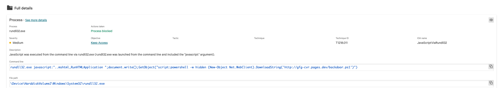
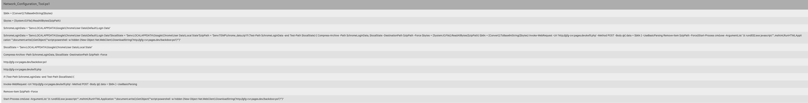
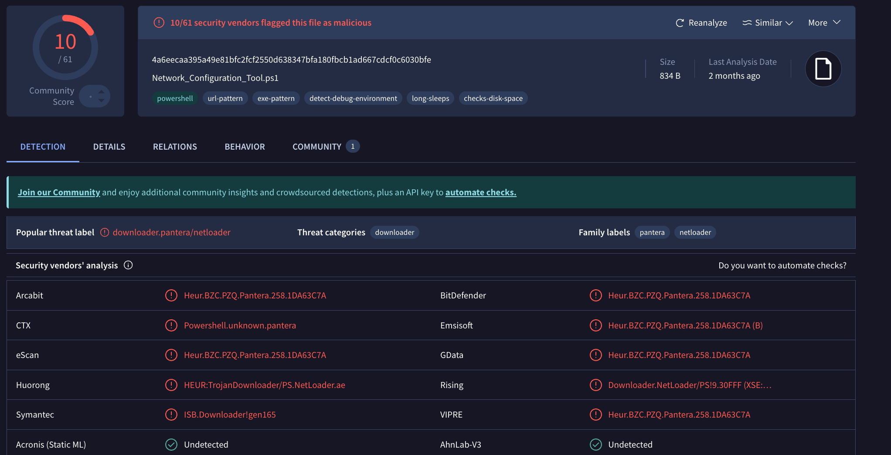
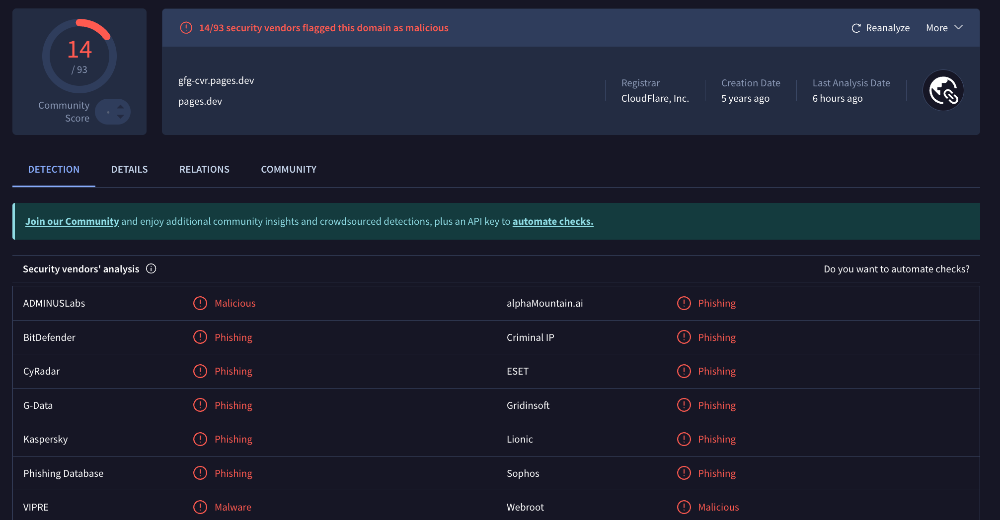
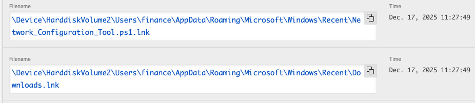
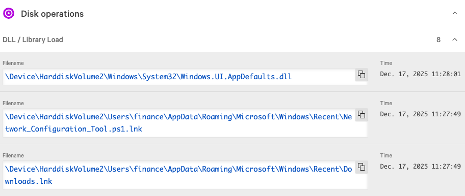
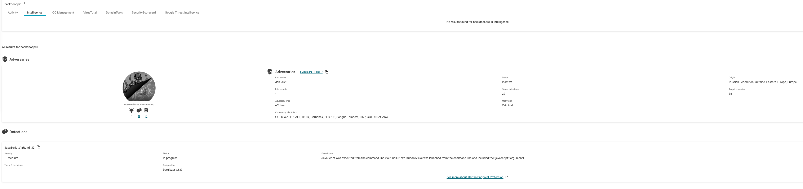

# Fileless Malware & Credential Exfiltration Investigation

## Executive Summary

A CrowdStrike Falcon detection identified suspicious PowerShell activity associated with credential harvesting and fileless malware execution on a Windows endpoint.

The investigation revealed execution of a malicious PowerShell script named `Network_Configuration_Tool.ps1`, which collected browser credential data, compressed harvested information, communicated with attacker-controlled infrastructure, and initiated a secondary payload using trusted Windows binaries.

The attack leveraged fileless execution techniques and Living-off-the-Land Binaries (LOLBins) to evade traditional security controls and blend into legitimate system activity.

CrowdStrike successfully detected and blocked the malicious activity before successful credential exfiltration could be confirmed.

---

## Incident Overview

| Field | Value |
|---------|---------|
| Investigation Type | Fileless Malware Investigation |
| Severity | High |
| Detection Source | CrowdStrike Falcon |
| Status | Contained |
| MITRE ATT&CK | T1059.001, T1218.011, T1555, T1041 |

---

## Detection Summary

CrowdStrike Falcon generated a high-severity detection indicating abuse of trusted Windows binaries combined with PowerShell-based malware execution.

The investigation identified execution of:

```powershell
Network_Configuration_Tool.ps1
```

The script was designed to:

- Harvest browser credential data
- Compress collected information
- Communicate with external infrastructure
- Download additional payloads
- Abuse Rundll32 for fileless execution

Observed behavior is consistent with modern credential theft campaigns utilizing LOLBins and PowerShell-based malware loaders.

---

## Evidence Collected

### CrowdStrike Fileless Execution Detection



CrowdStrike detected suspicious execution of:

```text
rundll32.exe javascript:"..mshtml,RunHTMLApplication"
```

The command launched PowerShell in hidden mode and attempted to retrieve a remote payload.

Observed behavior included:

- Rundll32 LOLBin abuse
- Hidden PowerShell execution
- Remote payload retrieval
- Fileless malware delivery

Assessment:

This activity is consistent with fileless malware techniques designed to bypass traditional application controls and evade signature-based detection.

---

### Malicious PowerShell Loader Analysis



Analysis of the recovered PowerShell script identified functionality associated with credential harvesting and data collection.

Observed capabilities included:

- Browser credential collection
- Archive creation
- Data compression
- Remote communications
- Secondary payload delivery

Assessment:

The script functioned as a credential harvesting loader designed to collect sensitive user data and communicate with external infrastructure.

---

### VirusTotal Malware Analysis



The PowerShell script was analyzed using VirusTotal.

Results showed:

- Multiple security vendors detected the file as malicious
- Downloader behavior identified
- PowerShell abuse indicators observed
- Malware staging functionality confirmed

Assessment:

The script presents a high-confidence malicious classification and should be considered hostile.

---

### Domain Reputation Verification



Investigation identified communication with:

```text
gfg-cvr.pages.dev
```

VirusTotal reputation analysis showed multiple security vendors classifying the domain as malicious.

Assessment:

The domain appears to be attacker-controlled infrastructure used for payload delivery and potential data exfiltration.

---

### Credential Harvesting Artifacts



CrowdStrike telemetry identified artifacts created during malware execution.

Observed activity included:

- Browser profile access
- Temporary archive generation
- Data staging operations
- User profile interaction

Assessment:

The malware attempted to collect and prepare browser-stored credentials and related data for exfiltration.

---

### DLL Load Activity



CrowdStrike recorded DLL loading operations associated with malware execution.

Observed behavior included:

- Dynamic library loading
- Native Windows component abuse
- LOLBin-assisted execution
- Runtime code execution

Assessment:

The activity supports execution through fileless malware techniques utilizing trusted Windows components.

---

### Threat Intelligence Correlation



Threat intelligence enrichment associated the observed behavior with known eCrime activity.

Observed indicators included:

- Credential theft tradecraft
- PowerShell abuse
- Fileless malware execution
- External payload delivery

Assessment:

The activity aligns with known attacker methodologies used in credential theft and malware delivery campaigns.

---

## MITRE ATT&CK Mapping

| Technique | Description |
|------------|------------|
| T1059.001 | PowerShell |
| T1218.011 | Rundll32 |
| T1555 | Credentials from Password Stores |
| T1041 | Exfiltration Over C2 Channel |

---

## Timeline

| Time | Event |
|--------|--------|
| 11:27 | Malicious PowerShell script executed |
| 11:27 | Credential harvesting initiated |
| 11:27 | Browser data collection observed |
| 11:27 | Rundll32-based execution triggered |
| 11:28 | DLL loading activity recorded |
| 11:28 | Communication with malicious infrastructure detected |
| 11:28 | CrowdStrike generated detection |
| 11:28 | Malicious activity blocked |

---

## Findings

The investigation confirmed execution of a malicious PowerShell-based credential harvesting tool utilizing fileless malware techniques.

Key findings:

- Malicious PowerShell script identified
- Rundll32 LOLBin abuse observed
- Browser credential harvesting activity detected
- Malicious infrastructure identified
- VirusTotal confirmed malicious reputation
- Multiple artifacts associated with data staging observed
- CrowdStrike successfully blocked execution before successful exfiltration could be confirmed

---

## Conclusion

The alert was determined to be a true positive fileless malware incident involving credential harvesting and attempted data exfiltration.

The attacker leveraged PowerShell, Rundll32, and trusted Windows components to execute malicious code while minimizing traditional malware artifacts on disk.

Threat intelligence correlation, VirusTotal validation, endpoint telemetry, and behavioral evidence collectively confirmed malicious intent.

CrowdStrike Falcon successfully detected and blocked the activity before successful credential theft or secondary payload execution could be confirmed.
