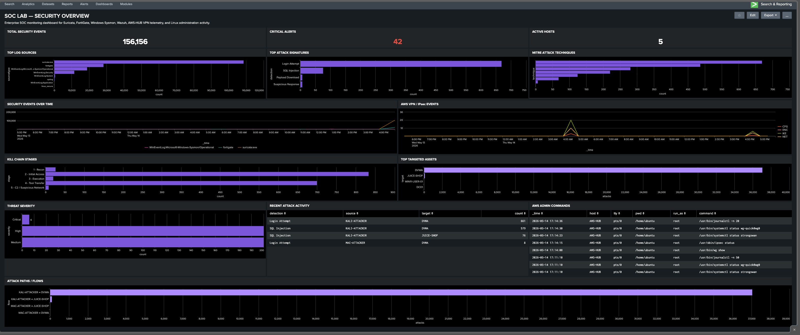

# Dashboards

This section documents the dashboards, visualizations, and monitoring capabilities built within the SOC Homelab Enterprise environment.

The goal is to simulate real SOC visibility, improve detection engineering workflows, and provide actionable monitoring for security investigations.

---

## Dashboard Goals

- Improve security visibility
- Centralize monitoring
- Simulate SOC analyst workflows
- Improve incident response
- Support detection engineering
- Correlate telemetry
- Track attack activity

---

## Primary SIEM Dashboards

### Splunk Enterprise

Splunk Enterprise functions as the Primary SIEM platform responsible for centralized monitoring, correlation, dashboards, and attack visibility.

Dashboard focus areas include:

- Security KPI visibility
- Threat monitoring
- Attack timelines
- MITRE ATT&CK visibility
- Log source monitoring
- SQL Injection activity
- Endpoint telemetry
- Threat severity
- Correlation workflows

---

### Wazuh XDR

Wazuh functions as the Secondary SIEM / XDR platform focused on endpoint visibility, alerting, rule-based detections, and security event correlation.

Dashboard focus areas include:

- Security alerts
- Endpoint telemetry
- Authentication activity
- IDS visibility
- Rule-based detections
- Security event monitoring

---

## Dashboard Categories

### Security Operations Dashboard

Focus areas:

- Security events
- Alert visibility
- Log volume
- SOC telemetry
- Monitoring health

Purpose:

Provide centralized SOC monitoring.

---

### MITRE ATT&CK Dashboard

Focus areas:

- ATT&CK techniques
- Attack correlation
- Threat mapping
- Detection coverage

Purpose:

Visualize attack activity against ATT&CK techniques.

---

### SQL Injection Dashboard

Focus areas:

- HTTP request visibility
- SQLi payload monitoring
- Suspicious URL patterns
- Attack telemetry
- Source and destination visibility

Example payloads monitored:

```text
' OR 1=1--
OR SLEEP(5)--
UNION SELECT
```

Purpose:

Support detection engineering and alert validation.

---

### Threat Timeline Dashboard

Focus areas:

- Event sequencing
- Timeline reconstruction
- Threat progression
- Investigation support

Purpose:

Support incident investigations.

---

### Threat Severity Dashboard

Focus areas:

- High severity alerts
- Medium severity alerts
- Low severity alerts
- Detection prioritization

Purpose:

Improve SOC alert visibility.

---

### Log Source Visibility Dashboard

Monitored sources include:

- Sysmon
- Windows Security Logs
- Suricata IDS
- FortiGate
- AWS HUB
- Active Directory

Purpose:

Validate telemetry ingestion and monitoring health.

---

## Dashboard Data Sources

Telemetry sources include:

```text
Sysmon
      ↓
Splunk / Wazuh

Suricata IDS
      ↓
Splunk / Wazuh

FortiGate
      ↓
Splunk / Wazuh

AWS HUB
      ↓
Splunk

Windows Events
      ↓
Splunk / Wazuh
```

---

## Dashboard Benefits

The dashboard environment improves:

- Threat visibility
- Detection engineering
- Alert monitoring
- Timeline reconstruction
- Investigation speed
- Telemetry validation
- Security awareness

---

## Current Dashboard Status

| Dashboard | Status |
|------------|--------|
| Splunk SOC Dashboard | ✅ Active |
| MITRE ATT&CK Dashboard | ✅ Active |
| SQL Injection Dashboard | ✅ Active |
| Threat Timeline Dashboard | ✅ Active |
| Threat Severity Dashboard | ✅ Active |
| Wazuh Security Dashboard | 🚧 In Progress |

---

## Skills Demonstrated

- SIEM Engineering
- Detection Engineering
- Threat Monitoring
- SOC Dashboard Development
- MITRE ATT&CK Mapping
- Attack Correlation
- Security Telemetry Analysis
- Incident Visibility
- Alert Prioritization
- Splunk Dashboard Engineering
- Wazuh XDR Monitoring

## Summary

The dashboard environment was designed to provide enterprise-style SOC visibility through Splunk and Wazuh dashboards focused on detection engineering, attack monitoring, telemetry correlation, and incident investigations.

## Splunk Security Overview Dashboard

The Splunk Security Overview dashboard provides centralized SOC visibility across Suricata IDS, FortiGate, Windows Sysmon, AWS-HUB VPN telemetry, and Linux administration activity.

This dashboard highlights:

- Total security events
- Critical alerts
- Active hosts
- Top log sources
- MITRE ATT&CK techniques
- Kill chain stages
- Threat severity
- Recent attack activity
- AWS administrative commands
- Attack paths and flows
- Top targeted assets

<p align="center">
  
</p>

### Dashboard Value

This dashboard demonstrates practical SIEM engineering, detection visibility, attack monitoring, and SOC analyst workflow development using Splunk Enterprise.
