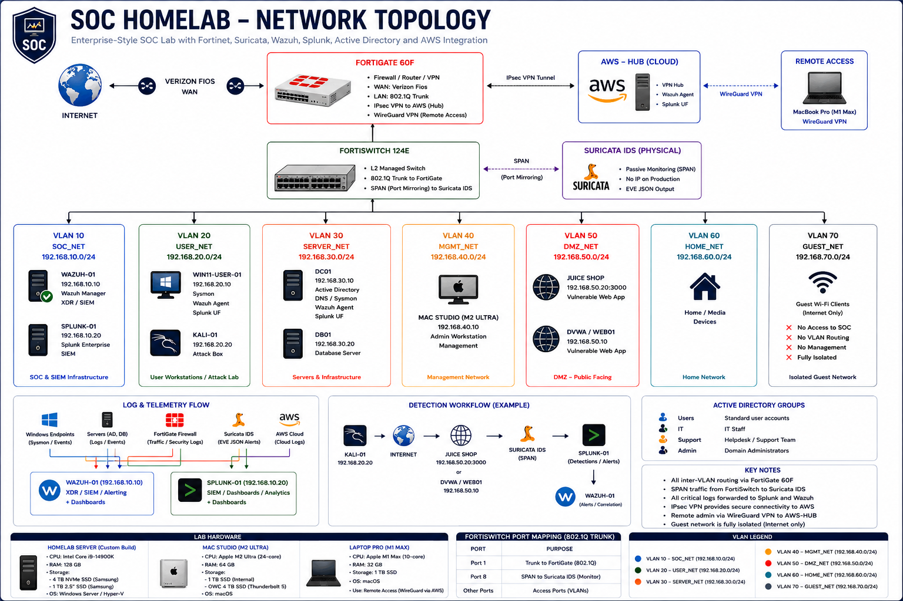

# SOC Homelab Enterprise

> **Enterprise-style SOC homelab focused on Detection Engineering, SIEM Engineering, Incident Response, and Blue-Team Security Monitoring.**

Enterprise-style SOC homelab built to simulate real-world Security Operations Center (SOC) workflows, detection engineering, SIEM monitoring, incident investigations, Active Directory security, network segmentation, and cloud-connected remote access.

This lab focuses on practical blue-team experience, detection engineering, SOC workflows, and enterprise security visibility.

---

## Key Objectives

- Build enterprise-style SOC architecture
- Build real-world SOC analyst experience
- Develop practical SOC analyst skills
- Practice detection engineering
- Simulate real-world incident response
- Improve SIEM engineering skills

---

## SOC Architecture Overview

  

---

## Core Security Stack

| Category | Technology |
|-----------|-------------|
| SIEM | Splunk Enterprise (Primary SIEM) + Wazuh XDR (Secondary SIEM) |
| IDS | Suricata IDS |
| Firewall | FortiGate 60F |
| Switch | FortiSwitch 124E |
| Endpoint Telemetry | Sysmon |
| Identity | Active Directory |
| Cloud | AWS HUB |
| Remote Access | WireGuard + IPsec VPN |
| Virtualization | Hyper-V |

---

## Current Lab Status

| Component | Status |
|------------|--------|
| Splunk Enterprise | ✅ Operational |
| Wazuh XDR | ✅ Operational |
| Suricata IDS | ✅ SPAN Monitoring Active |
| FortiGate VLAN Segmentation | ✅ Operational |
| Sysmon Telemetry | ✅ Active |
| AWS HUB | ✅ Connected |
| WireGuard Remote Access | 🚧 Planned|
| GitHub Documentation | 🚧 Active Development |

---

## Project Overview

This project demonstrates the design, implementation, and continuous improvement of an enterprise-style SOC homelab environment.

This environment is continuously expanded to strengthen practical SOC analyst skills, detection engineering capabilities, and enterprise security visibility.

The lab was built to simulate real-world blue-team operations including:

- Security monitoring
- Detection engineering
- SIEM engineering
- Incident response
- Threat hunting
- Network segmentation
- IDS monitoring
- Windows security telemetry
- Cloud-connected secure access

Core technologies include:

- **Splunk Enterprise**
- **Wazuh XDR / SIEM**
- **Suricata IDS**
- **FortiGate 60F**
- **FortiSwitch 124E**
- **Sysmon**
- **Windows Server 2022**
- **Active Directory**
- **AWS HUB**
- **WireGuard VPN**
- **IPsec VPN**
- **Hyper-V**

---

## Detection Engineering

This repository includes practical detection engineering scenarios:

- SQL Injection Detection
- Custom Splunk Detections
- Suricata IDS Monitoring
- Wazuh Correlation
- Alert Validation
- Attack Telemetry Analysis
- MITRE ATT&CK Mapping

---

## Incident Investigations

Security investigations and ticket-based incident response exercises including:

- Timeline reconstruction
- Evidence collection
- IOC analysis
- Threat investigation
- Root cause analysis
- SOC ticket workflow

---

## Dashboards & Visibility

Examples include:

- Security KPI Dashboards
- MITRE ATT&CK Mapping
- SQL Injection Monitoring
- Threat Timelines
- Attack Correlation
- Log Source Visibility

---

## Skills Demonstrated

- SIEM Engineering
- Detection Engineering
- Threat Detection
- SOC Operations
- Network Security
- IDS Monitoring
- Active Directory Security
- Sysmon Telemetry
- Incident Investigation
- Security Monitoring
- VPN & Secure Remote Access
- Cloud Security Integration

---

## Repository Structure

See documentation folders for:

- Architecture
- Infrastructure
- Detection Engineering
- Attack Simulations
- Incident Investigations
- Dashboards
- Lessons Learned
- Cloud Integration
- Active Directory

---

## Roadmap

The lab continues to evolve with:

- Detection improvements
- Additional incident investigations
- Dashboard enhancements
- Threat hunting workflows
- Detection tuning
- Documentation improvements

---

**Built for continuous learning, detection engineering, SOC analyst development, and cybersecurity portfolio demonstration.**
