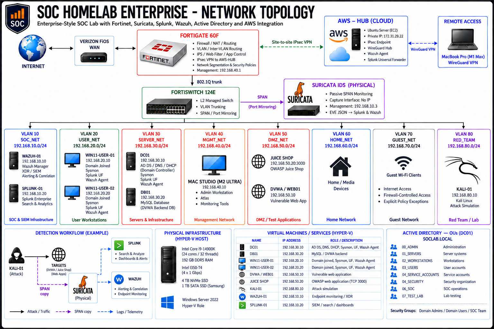

# SOC Homelab Enterprise


> Enterprise-style Security Operations Center (SOC) environment focused on SIEM Engineering, Detection Engineering, Incident Investigation, Network Security Monitoring, Firewall Engineering, and Blue-Team Operations.

---

## Project Overview

SOC Homelab Enterprise is a continuously evolving security environment built to simulate real-world enterprise Security Operations Center workflows.

The project combines security monitoring, detection engineering, Active Directory administration, network segmentation, firewall administration, cloud integration, incident investigation, and attack simulation into a single operational security platform.

The environment is designed to demonstrate practical SOC Analyst capabilities through hands-on implementation, monitoring, troubleshooting, validation, documentation, and continuous improvement.

The lab emphasizes:

* Security Monitoring
* SIEM Operations
* Detection Engineering
* Incident Investigation
* Network Security Monitoring
* Firewall Administration
* Active Directory Security
* Cloud Security Integration
* Attack Simulation Validation
* SOC Documentation

---

## SOC Architecture Overview

<div align="center">
  <a href="01-Architecture/soc-homelab-topology.png">
    
  </a>
</div>

---

## Core Security Stack

| Category                  | Technology                    |
| ------------------------- | ----------------------------- |
| SIEM / Security Analytics | Splunk Enterprise + Wazuh XDR |
| Network IDS               | Physical Suricata IDS Sensor  |
| Firewall                  | FortiGate 60F                 |
| Switching                 | FortiSwitch 124E              |
| Endpoint Telemetry        | Sysmon                        |
| Identity                  | Active Directory              |
| Cloud                     | AWS EC2 / AWS HUB             |
| VPN / Cloud Connectivity  | AWS Site-to-Site IPsec VPN    |
| Virtualization            | Hyper-V                       |

---

## Security Architecture Highlights

### Network Segmentation

The environment is segmented into dedicated security zones:

| Zone       | Purpose                                                   |
| ---------- | --------------------------------------------------------- |
| SOC_NET    | Splunk, Wazuh, and security monitoring infrastructure     |
| USER_NET   | Windows user endpoints                                    |
| SERVER_NET | Active Directory and infrastructure services              |
| MGMT_NET   | Administrative management systems                         |
| DMZ_NET    | Vulnerable web applications and attack simulation targets |
| HOME_NET   | Trusted personal devices                                  |
| GUEST_WIFI | Internet-only guest wireless access                       |
| RED_TEAM   | Offensive security and attack simulation systems          |

### Security Monitoring Infrastructure

The SOC monitoring stack includes:

* Splunk Enterprise
* Wazuh XDR
* Physical Suricata IDS Sensor
* Sysmon
* Active Directory Monitoring
* FortiGate Firewall Logging
* AWS Telemetry

### Network Detection Architecture

A physical Suricata IDS sensor receives mirrored traffic through a FortiSwitch SPAN port.

```text
FortiSwitch SPAN Port
        ↓
Physical Suricata IDS Sensor
        ↓
Splunk Enterprise + Wazuh XDR
```

### Cloud Integration

The lab includes hybrid cloud connectivity through AWS and FortiGate IPsec VPN.

* AWS EC2 / AWS HUB
* Site-to-Site IPsec VPN
* Hybrid SOC Connectivity
* Remote Log Collection
* Cross-Network Visibility

---

## Current Lab Status

| Component                   | Status               |
| --------------------------- | -------------------- |
| Splunk Enterprise           | ✅ Operational        |
| Wazuh XDR                   | ✅ Operational        |
| Physical Suricata IDS       | ✅ Operational        |
| FortiGate 60F               | ✅ Operational        |
| FortiSwitch 124E            | ✅ Operational        |
| Active Directory            | ✅ Operational        |
| Sysmon Telemetry            | ✅ Operational        |
| AWS Site-to-Site IPsec VPN  | ✅ Operational        |
| FortiSwitch SPAN Monitoring | ✅ Operational        |
| DMZ Attack Targets          | ✅ Operational        |
| GUEST_WIFI Isolation        | ✅ Implemented        |
| RED_TEAM Network            | ✅ Implemented        |
| GitHub Documentation        | ✅ Active Development |

---

## Practical Security Experience

This project demonstrates hands-on experience with:

* SIEM Engineering
* Detection Engineering
* Incident Investigation
* Security Monitoring
* Network Security
* Active Directory Security
* Firewall Administration
* FortiSwitch Administration
* Cloud Security Integration
* IDS Monitoring
* Threat Detection
* Attack Simulation
* Security Documentation
* Security Operations Workflows

---

## Attack Simulations

Current attack simulation scenarios include:

* SQL Injection Detection
* Web Application Attack Monitoring
* Hydra Brute Force Detection
* Reconnaissance Activity
* Detection Validation Exercises
* IDS Visibility Testing
* Security Telemetry Validation

Target systems include:

* OWASP Juice Shop
* DVWA
* Kali Linux Attack Platform

---

## Security Monitoring Capabilities

The monitoring architecture collects telemetry from:

* Windows Endpoints
* Windows Servers
* Active Directory
* Sysmon
* Suricata IDS
* FortiGate Firewall
* AWS Infrastructure
* Security Applications
* Attack Simulation Targets

Monitoring data is centralized within:

* Splunk Enterprise
* Wazuh XDR

---

## Skills Demonstrated

### Security Operations

* Alert Triage
* Event Correlation
* Incident Investigation
* Threat Analysis
* Security Monitoring
* Timeline Reconstruction
* IOC Analysis

### Detection Engineering

* Custom Detection Development
* Detection Validation
* Alert Tuning
* MITRE ATT&CK Mapping
* IDS Telemetry Analysis
* SIEM Correlation

### Network Security

* FortiGate Administration
* FortiSwitch Administration
* VLAN Segmentation
* Least Privilege Firewall Policies
* SPAN Port Monitoring
* Physical IDS Architecture
* IPsec VPN Administration
* Guest Wi-Fi Isolation
* Red Team Network Segmentation

### Active Directory Security

* Group Policy Administration
* Authentication Monitoring
* Privileged Activity Monitoring
* Security Event Analysis
* Domain Controller Monitoring
* Sysmon Integration

### Cloud Security

* AWS Integration
* Hybrid Security Monitoring
* Site-to-Site IPsec VPN Connectivity
* Cloud-Connected SOC Architecture

---

## Repository Structure

| Section                    | Description                                                              |
| -------------------------- | ------------------------------------------------------------------------ |
| 01-Architecture            | Network topology and enterprise SOC architecture                         |
| 02-Infrastructure          | Hardware, virtualization, and lab infrastructure                         |
| 03-Network                 | VLANs, routing, segmentation, and network design                         |
| 04-FortiGate-Security      | FortiGate firewall policies, segmentation, VPN, and FortiSwitch evidence |
| 05-Attack-Simulations      | Attack scenarios, detection validation, and telemetry analysis           |
| 06-Incident-Investigations | SOC investigation writeups and case studies                              |
| 07-Dashboards              | Splunk/Wazuh dashboards and security visibility                          |
| 08-Log-Pipeline            | Log forwarding, ingestion, and telemetry flow                            |
| 09-Cloud-Integration       | AWS connectivity and hybrid SOC integration                              |
| 10-Active-Directory        | AD, DNS, GPO, domain security, and identity monitoring                   |
| 11-Lessons-Learned         | Operational lessons and engineering takeaways                            |
| 12-Certifications          | Security certifications and training evidence                            |
| 13-Portfolio-Evidence      | Practical SOC, detection engineering, and security operations evidence   |
| 14-Roadmap                 | Planned improvements and future project direction                        |
| 99-Archive                 | Historical architecture evolution and previous lab designs               |

---

## Certifications & Training

* CompTIA Security+
* Cydeo SOC Analyst Program
* RangeForce SOC / Cybersecurity Training

---

## Roadmap

The project continues to evolve through:

* Additional Attack Simulations
* Incident Investigation Scenarios
* Detection Improvements
* Dashboard Enhancements
* Threat Hunting Workflows
* Detection Tuning
* Security Documentation Enhancements
* Interview Preparation Use Cases

---

## Portfolio Goal

This repository was built to demonstrate practical, hands-on experience with enterprise-style SOC operations, security monitoring, network defense, SIEM administration, detection engineering, firewall administration, cloud integration, and incident investigation.

The project serves as a professional portfolio showcasing the technical skills, operational workflows, troubleshooting methodology, and security mindset expected of a SOC Analyst working in a modern enterprise environment.

---

## Summary

SOC Homelab Enterprise combines FortiGate network security, FortiSwitch switching, Splunk and Wazuh monitoring, Physical Suricata IDS, Active Directory, Sysmon, AWS IPsec integration, DMZ attack targets, guest network isolation, and red team segmentation into a single practical blue-team security environment.

**Built to demonstrate practical enterprise security operations, blue-team workflows, detection engineering, and SOC Analyst capabilities.**
